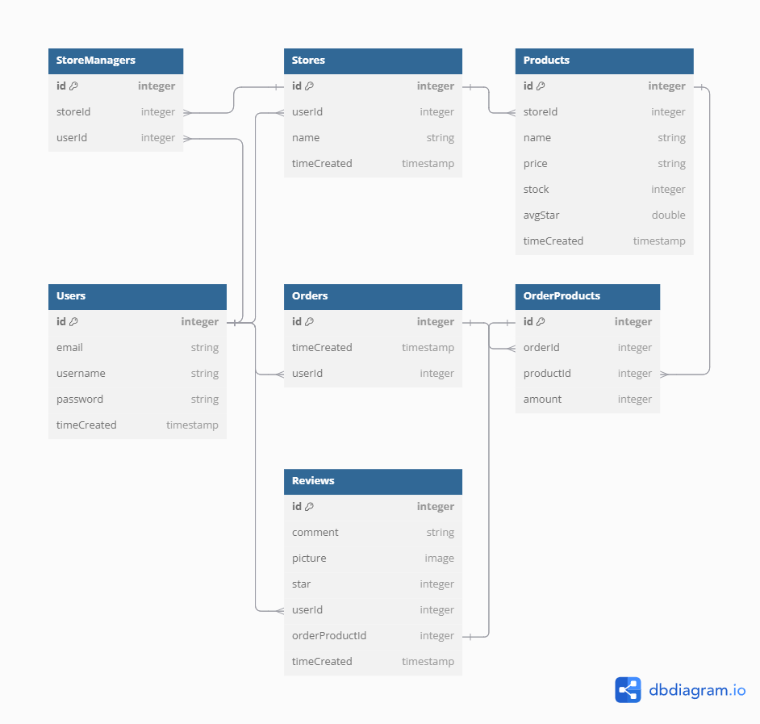

# Pet-2U Project

## Database Schema



## BACKEND APIS
## Authentication APIs

### Login Required
All apis that require a current logged in user.

- Request: all apis that require authentication
- Error Response:
  - Status Code: 401
  - Headers:
    - Content-Type: application/json
  - Body:
    ```json
    {
      "errors":
      {
        "message": "Unauthorized"
      }
    }
    ```

### Specific User Required
All apis that require users with right permission to view.

- Request: all apis that require proper authorization
- Error Response:
  - Status Code: 403
  - Headers:
    - Content-Type: application/json
  - Body:
    ```json
    {
      "message": "Forbidden"
    }
    ```

### Get all Users
Returns the information of all users

- Login Required: true
- Request:
  - Method: GET
  - URL: /api/users
  - Body: none
- Successful Response:
  - Status Code: 200
  - Headers:
    - Content-Type: application/json
  - Body:
    ```json
    {
      "users": [
        {
          "id": 1,
          "email": "john.smith@gmail.com",
          "username": "JohnSmith"
        }
      ]
    }
    ```

### Get an User with Specific id
Returns the information of a user with specific id

- Login Required: true
- Request:
  - Method: GET
  - URL: /api/users/:userId
  - Body: none
- Successful Response:
  - Status Code: 200
  - Headers:
    - Content-Type: application/json
  - Body:
    ```json
    {
      "id": 1,
      "email": "john.smith@gmail.com",
      "username": "JohnSmith"
    }
    ```

### Log In a User
Logs in a current user with email and password and returns the user's information.

- Login Required: false
- Request:
  - Method: POST
  - URL: /api/auth/login
  - Headers:
    - Content-Type: application/json
  - Body:
    ```json
    {
      "email": "john.smith@gmail.com",
      "password": "secret password"
    }
    ```
- Successful Response:
  - Status Code: 200
  - Headers:
    - Content-Type: application/json
  - Body:
    ```json
    {
      "id": 1,
      "email": "john.smith@gmail.com",
      "username": "JohnSmith"
    }
    ```
- Error Response: Invalid credentials
  - Status Code: 401
  - Headers:
    - Content-Type: application/json
  - Body:
    ```json
    {
      "error": "No such user exists. / Password was incorrect."
    }
    ```
- Error response: Body validation errors
  - Status Code: 400
  - Headers:
    - Content-Type: application/json
  - Body:
    ```json
    {
      "message": "Bad Request",
      "errors": {
        "email": "email is required / Email provided not found.",
        "password": "password is required"
      }
    }
    ```

### Log out
Log the current user out.

- Login Required: false
- Request
  - Method: GET
  - URL: /api/auth/logout
  - Body: none
- Successful Response:
  - Status Code: 200
  - Headers:
    - Content-Type: application/json
  - Body:
    ```json
    {
      "message": "User logged out"
    }
    ```

### Sign Up a User
Create a new user, log in, and return the user's information.

- Login Required: false
- Request
  - Method: POST
  - URL: /api/auth/signup
  - Headers:
    - Content-Type: application/json
  - Body:
    ```json
    {
      "username": "JohnSmith",
      "email": "john.smith@gmail.com",
      "password": "secret password"
    }
    ```
- Successful Response:
  - Status Code: 200
  - Headers:
    - Content-Type: application/json
  - Body:
    ```json
    {
      "id": 1,
      "email": "john.smith@gmail.com",
      "username": "JohnSmith"
    }
    ```
- Error response:
  - Status Code: 401
  - Headers:
    - Content-Type: application/json
  - Body:
    ```json
    {
      "errors": {
        "username": [
          "This field is required / Username is already in use."
        ],
        "email": [
          "This field is required / Email address is already in use."
        ],
        "password": [
          "This field is required"
        ]
      }
    }
    ```

## Store APIs

### Get all Stores
Returns the information of all stores

- Login Required: false
- Request:
  - Method: GET
  - URL: /api/stores
  - Body: none
- Successful Response:
  - Status Code: 200
  - Headers:
    - Content-Type: application/json
  - Body:
    ```json
    {
      "stores": [
        {
          "id": 1,
          "userId": 1,
          "name": "Pekaboo",
          "description": "This store sells ...",
          "created_on": "2024-09-23/13:35:20",
          "updated_on": "2024-09-23/13:35:20"
        }
      ]
    }
    ```

### Get Details of a Store
Returns the detailed information of a store with specific id

- Login Required: false
- Request:
  - Method: GET
  - URL: /api/stores/:storeId
  - Body: none
- Successful Response:
  - Status Code: 200
  - Headers:
    - Content-Type: application/json
  - Body:
    ```json
    {
      "id": 1,
      "userId": 1,
      "name": "Pekaboo",
      "description": "This store sells ...",
      "created_on": "2024-09-23/13:35:20",
      "updated_on": "2024-09-23/13:35:20",
      "Products": [
        {
          "id": 1,
          "storeId": 1,
          "name": "Oreo",
          "price": 288,
          "stock": 1,
          "sold": 0,
          "reviewCount": 0,
          "avgStar": -1,
          "previewImage": "default.png",
          "created_on": "2024-09-23/14:05:16",
          "updated_on": "2024-09-23/14:05:16"
        }
      ],
      "Owner": {
        "id": 1,
        "email": "john.smith@gmail.com",
        "username": "JohnSmith"
      },
      "StoreManagers": [
        {
          "id": 1,
          "storeId": 1,
          "userId": 2
        }
      ]
    }
    ```

### Create a Store
Create a new store and return its information

- Login Required: true
- Request:
  - Method: POST
  - URL: /api/stores
  - Headers:
    - Content-Type: application/json
  - Body:
    ```json
    {
      "name": "Pekaboo",
      "description": "This store sells ..."
    }
    ```
- Successful Response:
  - Status Code: 200
  - Headers:
    - Content-Type: application/json
  - Body:
    ```json
    {
      "id": 1,
      "userId": 1,
      "name": "Pekaboo",
      "description": "This store sells ...",
      "created_on": "2024-09-23/13:35:20",
      "updated_on": "2024-09-23/13:35:20"
    }
    ```

- Error response:
  - Status Code: 400
  - Headers:
    - Content-Type: application/json
  - Body:
    ```json
    {
      "message": "Store name already exists"
    }
    ```

### Update a Store
Update an existing store and return its information

- Login Required: true
- Specific User Required: must be the owner of the store
- Request:
  - Method: PUT
  - URL: /api/stores/:storeId
  - Headers:
    - Content-Type: application/json
  - Body:
    ```json
    {
      "name": "PekaPeka",
      "description": "This store is very ..."
    }
    ```
- Successful Response:
  - Status Code: 200
  - Headers:
    - Content-Type: application/json
  - Body:
    ```json
    {
      "id": 1,
      "userId": 1,
      "name": "PekaPeka",
      "description": "This store is very ...",
      "created_on": "2024-09-23/13:35:20",
      "updated_on": "2024-09-23/13:51:06"
    }
    ```
- Error response: Store not found
  - Status Code: 404
  - Headers:
    - Content-Type: application/json
  - Body:
    ```json
    {
      "message": "Store not found"
    }
    ```
- Error response: name duplication
  - Status Code: 400
  - Headers:
    - Content-Type: application/json
  - Body:
    ```json
    {
      "message": "Store name already exists"
    }
    ```

### Delete a Store
Delete an existing store

- Login Required: true
- Specific User Required: must be the owner of the store
- Request:
  - Method: DELETE
  - URL: /api/stores/:storeId
  - Body: none
- Successful Response:
  - Status Code: 200
  - Headers:
    - Content-Type: application/json
  - Body:
    ```json
    {
      "message": "Successfully Deleted"
    }
    ```
- Error response:
  - Status Code: 404
  - Headers:
    - Content-Type: application/json
  - Body:
    ```json
    {
      "message": "Store not found"
    }
    ```

## Product APIs

### Get all Products
Returns the information of all products

- Login Required: false
- Request:
  - Method: GET
  - URL: /api/products
  - Body: none
- Successful Response:
  - Status Code: 200
  - Headers:
    - Content-Type: application/json
  - Body:
    ```json
    {
      "products": [
        {
          "id": 1,
          "storeId": 1,
          "name": "Pikachu",
          "price": 300,
          "stock": 1,
          "sold": 0,
          "reviewCount": 1,
          "avgStar": 5,
          "previewImage": "default.png",
          "created_on": "2024-09-30/09:53:25",
          "updated_on": "2024-09-30/09:53:25"
        }
      ]
    }
    ```

### Get all Products of a Store
Returns the information of all products that belong to a store

- Login Required: false
- Request:
  - Method: GET
  - URL: /api/products/stores/:storeId
  - Body: none
- Successful Response:
  - Status Code: 200
  - Headers:
    - Content-Type: application/json
  - Body:
    ```json
    {
      "products": [
        {
          "id": 1,
          "storeId": 1,
          "name": "Pikachu",
          "price": 300,
          "stock": 1,
          "sold": 0,
          "reviewCount": 1,
          "avgStar": 5,
          "previewImage": "default.png",
          "created_on": "2024-09-30/09:53:25",
          "updated_on": "2024-09-30/09:53:25"
        }
      ]
    }
    ```

### Create a Product
Create a new store and return its information

- Login Required: true
- Request:
  - Method: POST
  - URL: /api/products
  - Headers:
    - Content-Type: application/json
  - Body:
    ```json
    {
      "storeId": 1,
      "name": "Pikachu",
      "price": 300,
      "stock": 1,
      "images": [
        "url://url.placeholder/1"
      ]
    }
    ```
- Successful Response:
  - Status Code: 200
  - Headers:
    - Content-Type: application/json
  - Body:
    ```json
    {
      "id": 1,
      "storeId": 1,
      "name": "Pikachu",
      "price": 300,
      "stock": 1,
      "sold": 0,
      "reviewCount": 0,
      "avgStar": -1,
      "previewImage": "default.png",
      "created_on": "2024-09-30/09:53:25",
      "updated_on": "2024-09-30/09:53:25",
      "ProductImages": [
        "url://url.placeholder/1"
      ]
    }
    ```

- Error response:
  - Status Code: 403
  - Headers:
    - Content-Type: application/json
  - Body:
    ```json
    {
      "message": "Store not owned by current user"
    }
    ```

### Update a Product
Update an existing store and return its information

- Login Required: true
- Specific User Required: must be the owner of the store of the product
- Request:
  - Method: PUT
  - URL: /api/product/:productId
  - Headers:
    - Content-Type: application/json
  - Body:
    ```json
    {
      "name": "Pichu",
      "price": 1000,
      "stock": 2,
      "images": [
        "url://url.placeholder/2"
      ]
    }
    ```
- Successful Response:
  - Status Code: 200
  - Headers:
    - Content-Type: application/json
  - Body:
    ```json
    {
      "id": 1,
      "storeId": 1,
      "name": "Pichu",
      "price": 1000,
      "stock": 2,
      "sold": 0,
      "reviewCount": 1,
      "avgStar": 5,
      "created_on": "2024-09-30/09:53:25",
      "updated_on": "2024-09-30/10:23:35",
      "ProductImages": [
        "url://url.placeholder/1",
        "url://url.placeholder/2"
      ]
    }
    ```
- Error response: Product not found
  - Status Code: 404
  - Headers:
    - Content-Type: application/json
  - Body:
    ```json
    {
      "message": "Product not found"
    }
    ```
- Error response: Validation Error
  - Status Code: 400
  - Headers:
    - Content-Type: application/json
  - Body:
    ```json
    {
      "message": "Stock/Price must be positive numbers"
    }
    ```

### Delete a Product
Delete an existing product

- Login Required: true
- Specific User Required: must be the owner of the store of the product
- Request:
  - Method: DELETE
  - URL: /api/product/:productId
  - Body: none
- Successful Response:
  - Status Code: 200
  - Headers:
    - Content-Type: application/json
  - Body:
    ```json
    {
      "message": "Successfully Deleted"
    }
    ```
- Error response:
  - Status Code: 404
  - Headers:
    - Content-Type: application/json
  - Body:
    ```json
    {
      "message": "Product not found"
    }
    ```

## Order APIs

### Create an Order
Create a new order and return its information

- Login Required: true
- Request:
  - Method: POST
  - URL: /api/orders
  - Headers:
    - Content-Type: application/json
  - Body:
    ```json
    {
      "products": [
        {
          "productId": 1,
          "amount": 1,
          "price": 300
        }
      ]
    }
    ```
- Successful Response:
  - Status Code: 200
  - Headers:
    - Content-Type: application/json
  - Body:
    ```json
    {
      "id": 1,
      "userId": 1,
      "created_on": "2024-09-30/10:52:44",
      "updated_on": "2024-09-30/10:52:44",
      "OrderProducts": [
        {
          "productId": 1,
          "amount": 1,
          "price": 300,
        }
      ]
    }
    ```

### Get Details of an Order
Returns the detailed information of an order with specific id

- Login Required: true
- Specific User Required: must be the user that made the order
- Request:
  - Method: GET
  - URL: /api/orders/:orderId
  - Body: none
- Successful Response:
  - Status Code: 200
  - Headers:
    - Content-Type: application/json
  - Body:
    ```json
    {
      "id": 1,
      "userId": 1,
      "created_on": "2024-09-30/10:52:44",
      "updated_on": "2024-09-30/10:52:44",
      "User": {

      },
      "OrderProducts": [
        {
          "productId": 1,
          "amount": 1,
          "price": 300,
        }
      ]
    }
    ```

## OrderProduct APIs

### Delete Part of an Order
Delete part of an order

- Login Required: true
- Specific User Required: must be the owner of the store of the product
- Request:
  - Method: DELETE
  - URL: /api/orderproducts/:orderproductId
  - Body: none
- Successful Response:
  - Status Code: 200
  - Headers:
    - Content-Type: application/json
  - Body:
    ```json
    {
      "message": "Successfully Deleted"
    }
    ```
- Error response:
  - Status Code: 404
  - Headers:
    - Content-Type: application/json
  - Body:
    ```json
    {
      "message": "OrderProduct not found"
    }
    ```

## ProductImage APIs

### Delete a ProductImage

- Login Required: true
- Specific User Required: must be the owner of the store of the product
- Request:
  - Method: DELETE
  - URL: /api/productimages/:productimageId
  - Body: none
- Successful Response:
  - Status Code: 200
  - Headers:
    - Content-Type: application/json
  - Body:
    ```json
    {
      "message": "Successfully Deleted"
    }
    ```
- Error response:
  - Status Code: 404
  - Headers:
    - Content-Type: application/json
  - Body:
    ```json
    {
      "message": "ProductImage not found"
    }
    ```
