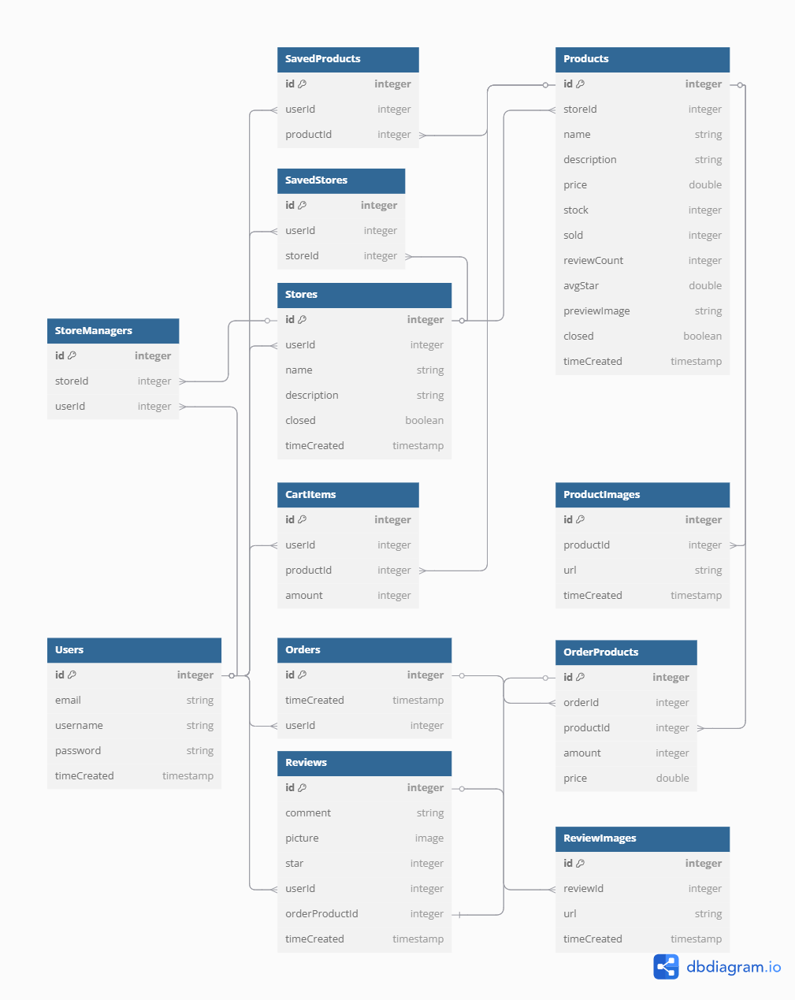

# Pet-2U Project

## Database Schema



## BACKEND APIS
## Authentication

### Login Required
All apis that require a current logged in user.

- Request: all apis that require authentication
- Error Response:
  - Status Code: 401
  - Headers:
    - Content-Type: application/json
  - Body:
    ```json
    {
      "errors":
      {
        "message": "Unauthorized"
      }
    }
    ```

### Specific User Required
All apis that require users with right permission to view.

- Request: all apis that require proper authorization
- Error Response:
  - Status Code: 403
  - Headers:
    - Content-Type: application/json
  - Body:
    ```json
    {
      "message": "Forbidden"
    }
    ```

### Get all Users
Returns the information of all users

- Login Required: true
- Request:
  - Method: GET
  - URL: /api/users
  - Body: none
- Successful Response:
  - Status Code: 200
  - Headers:
    - Content-Type: application/json
  - Body:
    ```json
    {
      "users": [
        {
          "id": 1,
          "email": "john.smith@gmail.com",
          "username": "JohnSmith"
        }
      ]
    }
    ```

### Get an User with Specific id
Returns the information of a user with specific id

- Login Required: true
- Request:
  - Method: GET
  - URL: /api/users/:userId
  - Body: none
- Successful Response:
  - Status Code: 200
  - Headers:
    - Content-Type: application/json
  - Body:
    ```json
    {
      "id": 1,
      "email": "john.smith@gmail.com",
      "username": "JohnSmith"
    }
    ```

### Log In a User
Logs in a current user with email and password and returns the user's information.

- Login Required: false
- Request:
  - Method: POST
  - URL: /api/auth/login
  - Headers:
    - Content-Type: application/json
  - Body:
    ```json
    {
      "email": "john.smith@gmail.com",
      "password": "secret password"
    }
    ```
- Successful Response:
  - Status Code: 200
  - Headers:
    - Content-Type: application/json
  - Body:
    ```json
    {
      "id": 1,
      "email": "john.smith@gmail.com",
      "username": "JohnSmith"
    }
    ```
- Error Response: Invalid credentials
  - Status Code: 401
  - Headers:
    - Content-Type: application/json
  - Body:
    ```json
    {
      "error": "No such user exists.",
      // or
      "error": "Password was incorrect."
    }
    ```
- Error response: Body validation errors
  - Status Code: 400
  - Headers:
    - Content-Type: application/json
  - Body:
    ```json
    {
      "message": "Bad Request",
      "errors": {
        "email": "email is required" /-or-/ "Email provided not found.",
        "password": "password is required"
      }
    }
    ```

### Log out
Log the current user out.

- Login Required: false
- Request
  - Method: GET
  - URL: /api/auth/logout
  - Body: none
- Successful Response:
  - Status Code: 200
  - Headers:
    - Content-Type: application/json
  - Body:
    ```json
    {
      "message": "User logged out"
    }
    ```

### Sign Up a User
Create a new user, log in, and return the user's information.

- Login Required: false
- Request
  - Method: POST
  - URL: /api/auth/signup
  - Headers:
    - Content-Type: application/json
  - Body:
    ```json
    {
      "username": "JohnSmith",
      "email": "john.smith@gmail.com",
      "password": "secret password"
    }
    ```
- Successful Response:
  - Status Code: 200
  - Headers:
    - Content-Type: application/json
  - Body:
    ```json
    {
      "id": 1,
      "email": "john.smith@gmail.com",
      "username": "JohnSmith"
    }
    ```
- Error response:
  - Status Code: 401
  - Headers:
    - Content-Type: application/json
  - Body:
    ```json
    {
      "errors": {
        "username": [
          "This field is required", // or
          "Username is already in use."
        ], // and/or
        "email": [
          "This field is required", // or
          "Email address is already in use."
        ], // and/or
        "password": [
          "This field is required"
        ]
      }
    }
    ```
